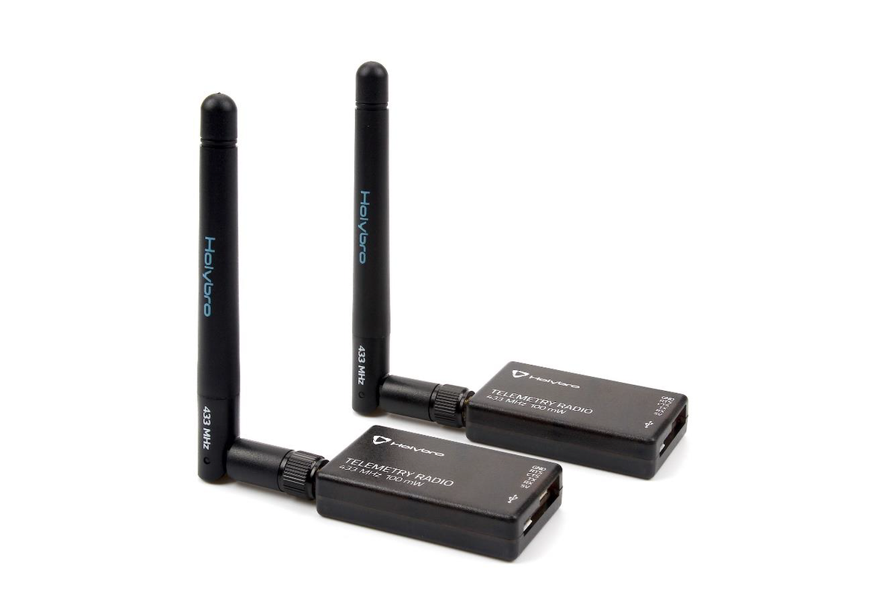

# SiK MultiPoint Firmware

**NOTE: This was forked from [Project-GrADyS/SiK-multipoint](https://github.com/Project-GrADyS/SiK-multipoint).**

## About The Project

This firmware is for adding multipoint support to the SiLabs Si1000 - Si102x/3x ISM radios. The SiK telemetry radios use the Si1000 SoC's and this firmware has been tested on the V2 and V3 radios from Holybro.

Currently, it supports the following boards:

- HopeRF HM-TRP
- HopeRF RF50-DEMO
- RFDesign RFD900a
- RFDesign RFD900u
- RFDesign RFD900p

Adding support for additional boards should not be difficult.

Currently the firmware components include:

- A bootloader with support for firmware upgrades over the serial interface.
- Radio firmware with support for parsing AT commands, storing parameters and FHSS/TDM functionality

## Multipoint Support - Differences from standard image

### New AT Variables

The AT commands, which stand for "Attention" commands, are a set of instructions used for controlling and communicating with various devices, particularly communication modules such as GSM, GPRS, and other modems. These commands are sent to the device through a communication interface, typically serial communication. Here are new commands used for multipoint firmware:

#### S15: NODEID

MUST be a unique ID on the network, otherwise cross talk will occur
Base ID is defined by setting to 0, this is the node that keeps the network in sync with all other nodes.
When setting the the NODEID to the base (ie 0) it will always have link to it's self thus link will never be lost.

#### S16: NODEDESTINATION

This is where all the serial data recived on this node should be sent to.
For example, to send all data to the base node only set this to 0.
DEFAULT is 65535 which is broadcast to all nodes.

#### S17: SYNCANY

Sync Any should be used sparingly, this allows any node to sync from any node in the network not just the base.
By allowing many nodes to sync from each other they could drift away from the main sync channel,
thus effectively becoming a different NETID.

#### S18: NODECOUNT

This is the number of nodes in the nework, so if you have 3 nodes (Id's 0, 1, 2) you have a network of 3.
In the next revision of the software this could disapear and become auto detect.
The easiest way to determine the correct node count for the network is - max(NODEID)+1

### Different RT Syntax

All RT's are sent to every node by default, to send them to one node only folow the command with a comma and node id.
Example getting the parameter list from base node would be 'RTI5,0'

_To see all other available AT commands, see the [Documentation](https://ardupilot.org/copter/docs/common-3dr-radio-advanced-configuration-and-technical-information.html)_

_Here is the official radio [SiK Repository](https://github.com/ArduPilot/SiK)_

## Downloading the firmware

If you don't want to build the firmware from scratch, you can download it from the [releases page](https://github.com/1Blademaster/SiK-multipoint/releases) on this repo. The files uploaded were built when I'm writing this (20/11/2025).

## Building the firmware

You can very easily build the firmware by running the `run.bat` file in the terminal. This has been tested and works on Windows. If you are using Mac or Linux then you can run the docker commands within the `run.bat` file to build the firmware on your system.

The built firmware will be extracted into an `output` folder, this includes the bootloader `.hex` files and the `.ixh` files which are used to flash the radios with the new firmware.

## Using the firmware

I'm going to guess that if you're building the firmware then you know how to flash your radios and how to configure them to use the multipoint support. The point of this repo is to make it easy to build and extract the firmware on any OS with the use of Docker.
